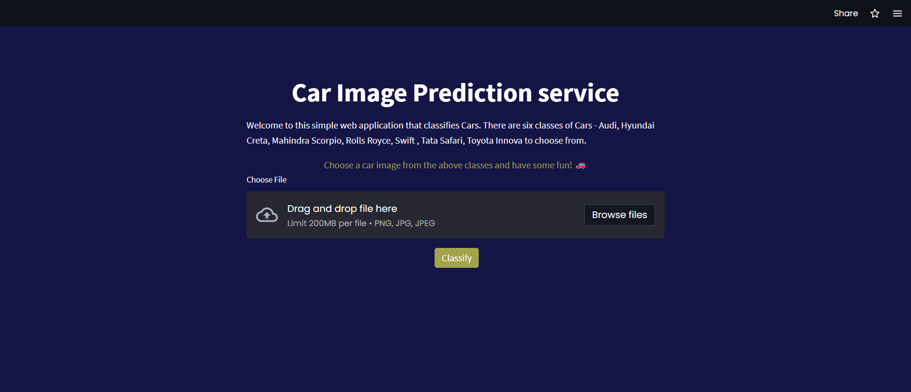
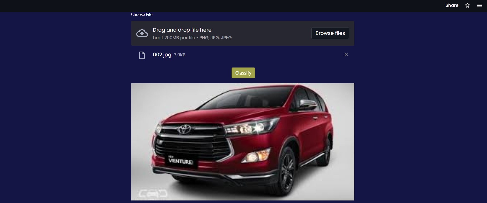
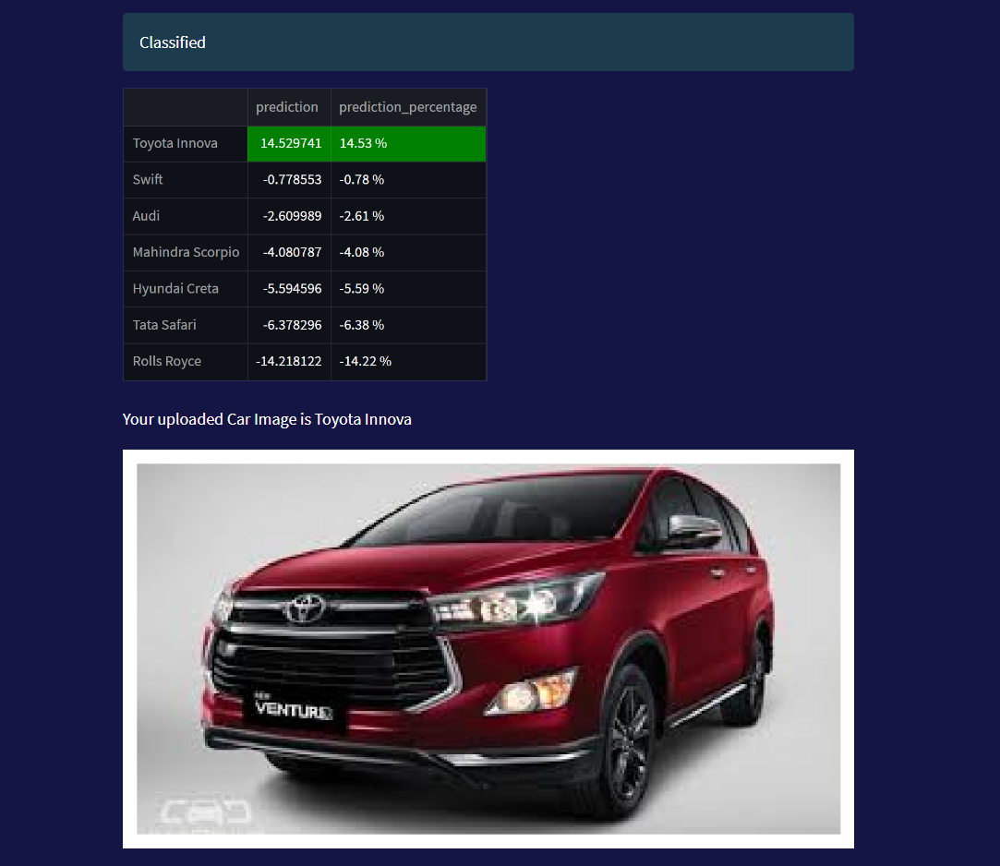

# Project - Car Image classification

Link to Original dataset: https://www.kaggle.com/datasets/kshitij192/cars-image-dataset

## Project description

## Datset breakdown
More data engineering was done on the downloaded dataset to breakit down into train, validation and test dataset.
| Car Class        | Train | Validation | Test | Total |
| ---------------- | ----- | ---------- | ---- | ----- |
| Audi             | 814   | 128        | 71   | 1013  |
| Hyundai Creta    | 271   | 42         | 25   | 338   |
| Mahindra Scorpio | 316   | 43         | 32   | 391   |
| R  olls Royce    | 311   | 40         | 34   | 385   |
| Swift            | 424   | 59         | 43   | 526   |
| Tata Safari      | 441   | 67         | 39   | 547   |
| Toyota Innova    | 775   | 122        | 68   | 965   |

## Aim

## Result
An interactive car image prediction service where pictures can be uploaded and classified. It can be viewed here:
    https://edidiongesu-mlzoomcamp-capstone-one-main-app-6b2cid.streamlit.app/

Here is the interface:
    

Upload an image:
    

Classify the car image:
    

## Files in repo
### Folders
- Dataset: Contains all the images used to train the model. They are seperated into train,test and validation folders.
- css: Contains Custom.css file used for beautifying the streamlit applicatiion.
- Images: All relevant images.
  
### FIles
- `main_app.py` - streamlit app file.
- `requirements.txt` - Containing all the required python packages to successfully run and build tha application.
- `car-model.tflite` - tensorflow-lite model
- `xception_v4_1_39_0.954.h5` and `model_v4.h5`: Tensorflow models.
- `train.py`, `tflite_converter.py` and `test.py` - python scripts for training your dataset, converting to tflite and testing respectively.
- `notebook-train.ipynb` - Contains all EDA and extensive training of CNN models.
- `notebook-tfconverter.ipynb` - Notebook for converting tensorflow model to tensorflow lite.
-`.gitignore` and `gitattributes` - excluding files and handling large git files respectively.

## How to reproduce project
To quickly run project:
- Create a new Virtual environment in your machine (Recommended)
- Download/clone repository.
- Install requirements.text file by running `pip install -r requirements.txt`
- run `python test.py` in main driectory. You should a result ouput in terminal that looks like:
            

- Create a streamlit account and connect to your github repository. Then create a new app.
- Choose the main file path as shown below:
            
- Deploy!

## Happy Coding!

